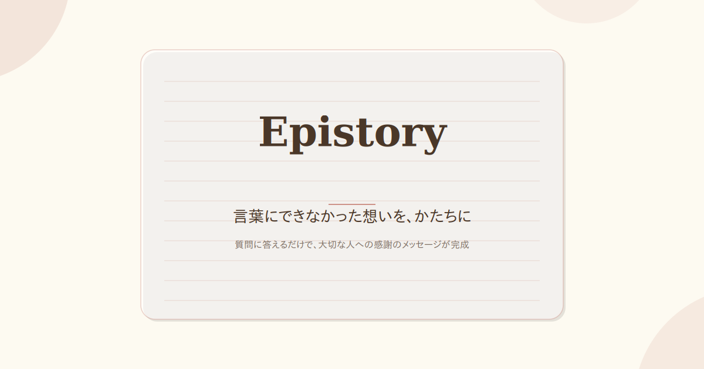
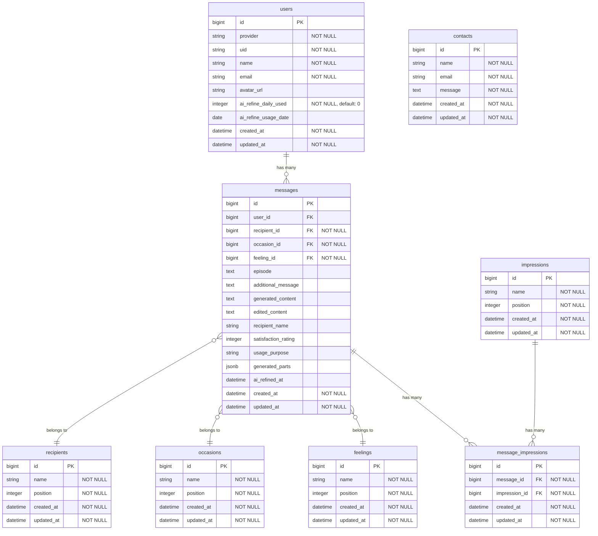

  

<h1 align="center">Epistory</h1>

  質問に答えるだけで、感謝のメッセージを作成できる支援サービス

  

---

## サービス概要

大切な人へ伝えたい感謝の気持ちを、質問に答えるだけで文章として整理できるメッセージ作成支援サービスです。
言葉にするのが苦手な人でも、自分の想いを無理なく形にできます。
完成したメッセージは編集・保存でき、手紙やSNSなど様々な用途で利用できます。

---

## このサービスへの思い・作りたい理由

家族の記念日や誕生日に手紙を書いて渡すようにしていたところ、ある日その手紙を肌身離さず持ってくれていると知りました。
何気なく書いた短い手紙でも、もらった人にとってはどんな高価なプレゼントよりも価値がある。そう気づいたことが、このサービスの出発点です。

一方で、SNS時代の今、手紙を書く機会は減っています。
感謝の気持ちはあるけれど、直接伝えるのは照れくさい、何を書けばいいかわからない、字に自信がない。理由は様々です。

**気持ちが足りないのではなく、"言語化する手助け"が足りていないだけではないか。**

メッセージの作成から共有まで一貫してお手伝いすることで、大切な人に想いを届けるきっかけを提供したい。そんな思いからこのサービスを作りました。

---

## ユーザー層について

### 想定ユーザー

- 家族や恋人、友人に感謝を伝えたい人
- 文章を書くことに苦手意識がある人
- 特別なタイミング（誕生日・記念日・日常の感謝）を迎えている人

### このユーザー層を選んだ理由

感謝の気持ちを伝えたい相手がいる人は多い一方で、それを言葉にすることに悩む人も非常に多いと感じています。
年齢や職業に関係なく共通する課題であり、シンプルな支援で大きな価値を提供できると考え、このユーザー層を対象としました。

---

## サービスの利用イメージ

ユーザーは、相手との関係性や伝えたい感情などの質問に答えていくだけで、メッセージの下書きを作成できます。
生成された文章は自由に編集でき、自分の言葉として完成させることができます。

このサービスを利用することで、

- 気持ちを整理するきっかけが得られる
- メッセージ作成の心理的ハードルが下がる
- 大切な人に想いを伝える一歩を踏み出せる

といった価値を提供します。

---

## ユーザーの獲得について

- SNS（X / Instagram）での発信・シェア
- Qiita / Zennでの開発・設計記事の公開
- RUNTEQポートフォリオサイトからの導線

「感謝を伝える」という共感性の高いテーマを活かし、自然な形でユーザーに届けることを想定しています。

---

## サービスの差別化ポイント・推しポイント

本サービスは「大切な人への感謝を伝えるメッセージ作成支援」を目的としています。
類似するサービスとして、以下のようなものが存在します。

### 想定される競合サービス

- AI文章生成サービス（ChatGPT 等）
- 定型文・例文提供サービス（メッセージ例文サイト）
- 手紙作成支援アプリ・テンプレート集

それぞれと本サービスを比較した際の違い・強みは以下の通りです。

---

### 他サービスとの比較

| 観点 | 本サービス | AI文章生成サービス | 例文・テンプレサイト |
|----|----|----|----|
| メッセージの主役 | ユーザー自身 | AI | サイト側 |
| 気持ちの整理 | ◎ 質問誘導で整理できる | △ 指示次第 | × できない |
| オリジナリティ | ◎ 高い | ○ プロンプト次第 | × 低い |
| 書くハードル | ◎ 低い | △ 書き方が必要 | ○ |
| 感情への寄り添い | ◎ | ○ | △ |

---

### 差別化ポイント①：質問誘導型によるメッセージ作成

本サービスの最大の特徴は、**質問に答えていくことで自然と自分の気持ちが整理され、文章になる設計**です。
完成した文章はテンプレートではなく、ユーザー自身の体験や感情を反映したものになります。

単に「文章を生成する」のではなく、
**「気持ちを言語化するプロセス」を提供する点**が他サービスとの大きな違いです。

---

### 差別化ポイント②：AIはあくまでサポート役

本サービスでは、メッセージの主役はあくまでユーザー自身です。
テンプレート＋条件分岐によるロジック設計で、**AIがなくても成立する体験設計**を基盤としています。

その上で、AI添削機能（トーン調整・表現の言い換え）を補助的に提供しており、
ユーザーが自分の言葉をベースに、より伝わる表現へ磨き上げることができます。

- ユーザーの入力内容を重視した文章生成
- AIはトーン調整・表現補助に限定
- 主役はユーザー、AIはサポート役

---

### 差別化ポイント③：「考える時間」に価値を置いている点

例文サイトやAI生成では、短時間で文章が完成する一方で、
「自分の気持ちと向き合う時間」が省略されがちです。

本サービスでは、質問に一つずつ答えていくステップ形式を採用することで、
**ユーザーが自分の感情を振り返り、整理する時間**を自然に確保できます。

この「考える時間そのものに価値がある」という設計思想が、本サービスの推しポイントです。

---

### 差別化ポイント④：答えやすい質問設計

抽象的な問い（「なぜ感謝したいのか」など）をそのまま投げかけると、ユーザーは答えに困ってしまいます。
本サービスでは、**具体的で選びやすい形に変換した質問設計**を採用しています。

#### 質問設計の工夫

| 工夫 | 効果 |
|---|---|
| 選択式を多用 | 考える負担を減らす |
| 具体的なヒント例を提示 | 「何を書けばいいか」が分かる |
| 自由記述は最小限 | ハードルを下げる |
| スキップ可能な質問を用意 | 無理なく進められる |
| ポジティブな選択肢のみ | 書く気持ちを後押し |

#### 質問フロー

**ステップ1: 相手を選ぶ**
「誰にメッセージを届けたいですか？」
→ 親 / パートナー / 友人 / 兄弟・姉妹 / 祖父母 / 職場の人 / その他

**ステップ2: きっかけを選ぶ**
「メッセージを届けたいと思ったきっかけは？」
→ 誕生日・記念日 / 日頃の感謝 / 最近助けてもらった / しばらく会えていない / 特別な理由はない / その他

**ステップ3: 相手の印象を選ぶ（複数選択可）**
「その人はあなたにとってどんな存在ですか？」
→ いつも支えてくれる / 一緒にいると安心する / 自分を理解してくれる / 困ったときに頼れる / 笑顔にしてくれる / 尊敬している / 刺激をもらえる

**ステップ4: 思い出すエピソード（自由記述）**
「最近、その人との間であった出来事を教えてください。小さなことでOKです。」
ヒント例: 「体調が悪いとき、〇〇してくれた」「落ち込んでいたとき、話を聞いてくれた」

**ステップ5: 伝えたい気持ちを選ぶ**
「一番伝えたい気持ちはどれですか？」
→ ありがとう / これからもよろしく / いつも助かっている / 大切に思っている / ごめんね、そしてありがとう

**ステップ6: 言葉にしたい想い（任意・スキップ可）**
「他に伝えたいことがあれば、自由に書いてください。」

---

この質問設計により、ユーザーは深く考えなくても自然に気持ちを整理でき、最終的に「自分の言葉」として納得感のあるメッセージが生成されます。

---

### 本サービスが向いているユーザー

- AIに丸投げせず、自分の言葉で伝えたい人
- 気持ちを整理しながら文章を書きたい人
- テンプレ感のないメッセージを送りたい人

---

## 主な機能

### 6ステップウィザードによるメッセージ作成

質問に答えていくだけで、感謝のメッセージが完成します。選択式中心の設計で、文章が苦手な人でも迷わず進められます。

<!-- TODO: スクリーンショットを追加 -->
<!--  -->

### AI添削機能

作成したメッセージをAIがトーン調整・表現の言い換えで磨き上げます。カジュアル・丁寧・フォーマルなどのトーンを選択可能。

<!-- TODO: スクリーンショットを追加 -->
<!--  -->

### メッセージの編集・再生成

生成されたメッセージは自由に編集でき、パート別の再生成にも対応。納得いくまで調整できます。

<!-- TODO: スクリーンショットを追加 -->
<!--  -->

### 画像出力・コピー

完成したメッセージを画像として保存したり、クリップボードにコピーしてSNSやLINEで共有できます。

<!-- TODO: スクリーンショットを追加 -->
<!--  -->

### その他の機能

- Google OAuthによるユーザー登録・ログイン
- メッセージ履歴の保存・サイドバー表示
- 簡易アンケート機能
- お問い合わせフォーム
- 利用規約・プライバシーポリシー

---

## 使用する技術スタック

### バックエンド

- Ruby 3.2
- Ruby on Rails 7.0

質問回答をもとに文章を組み立てるロジックをRailsで実装しています。

---

### フロントエンド

- Hotwire（Turbo / Stimulus）
- Tailwind CSS

Rails標準構成を活かしつつ、シンプルで快適なUXを実現しています。

---

### データベース

- PostgreSQL（Neon）

本番環境ではサーバーレスPostgreSQLサービスのNeonを使用しています。

---

### 開発環境

- Docker
- Docker Compose

開発環境をコンテナ化し、環境差異による問題を防いでいます。

---

### デプロイ先

- Render

Rails + PostgreSQL を手軽にデプロイでき、ポートフォリオ用途に適しています。

---

### CI/CD

- GitHub Actions

PR作成・mainへのpush時に、RuboCopによるLintチェックとMinitestによるテストを自動実行しています。

---

### テスト

- Minitest（Rails標準）

#### 導入理由

- Rails標準のため追加gemが不要で、セットアップコストがゼロ
- シンプルなAPIで学習コストが低く、テストコード自体の可読性が高い
- 実行速度が速く、CI上でも短時間でフィードバックが得られる

#### テスト構成

| カテゴリ | テスト数 | 対象 |
|---|---|---|
| モデル | 75 | バリデーション、アソシエーション、ビジネスロジック |
| コントローラ | 100 | リクエスト・レスポンス、認証、リダイレクト |
| サービス | 78 | メッセージ生成ロジック、AI添削処理 |
| システム | 12 | メッセージ作成・編集のE2Eフロー |
| ヘルパー / その他 | 14 | ビューヘルパー、メーラー |
| **合計** | **279** | **22ファイル / 約3,000行** |

#### カバレッジ方針

- 新しいコード（モデル・コントローラ・サービス・ヘルパー）には必ず対応するテストを追加する運用ルールを設けている
- メッセージ作成の6ステップウィザードは、ステップごとのバリデーション・遷移をコントローラテストで網羅
- メッセージ生成ロジック（`MessageGenerator`）は71テストケースで全パターンの出力を検証

---

### 使用しているライブラリ・ツール

| ライブラリ | 用途 |
|---|---|
| OmniAuth (omniauth-google-oauth2) | Google OAuth認証 |
| Tailwind CSS | UIスタイリング |
| Hotwire (Turbo / Stimulus) | SPAライクなページ遷移・JS制御 |
| ruby-openai | AI添削機能（Claude API経由） |
| Kaminari | ページネーション |
| html2canvas | メッセージの画像出力（フロントエンド） |

---

## 未ログインでも閲覧または利用できるページ

- トップページ（LP）
- 質問フォーム（メッセージ作成）
- メッセージ編集・プレビュー画面
- メッセージコピー・画像出力
- 利用規約・プライバシーポリシー
- お問い合わせフォーム

※メッセージ履歴の保存・閲覧にはGoogleログインが必要です。

---

## 認証について

本サービスではDeviseを使わず、OmniAuth + Google OAuthによるソーシャルログインを採用しています。

### Deviseを使用しない理由

| 観点 | メリット |
|---|---|
| 依存の削減 | Devise本体＋関連gemが不要になり、依存パッケージを最小限に保てる |
| コードの見通し | 認証フローが薄いコントローラ1つで完結し、ブラックボックスがない |
| セキュリティ | パスワード管理・リセット機能が不要になり、攻撃面が縮小する |
| UX | ワンクリックでログインでき、ユーザーの登録離脱を抑えられる |
| 保守コスト | Deviseのアップデートや設定変更に振り回されず、長期的に保守しやすい |

- ログイン: Googleアカウントで認証
- ログアウト: セッション破棄

---

## 画面遷移図
https://www.figma.com/design/9QruxKoB77hXPXCXQ9I2O0/KIMOTI-LETTER?node-id=38-177&t=AltsXxjQJ4qeLmzd-1

---

## ER図

